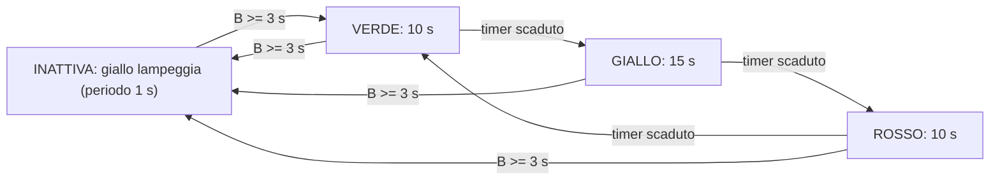

# Lanterna semaforica v2 - uso del timer

Base di partenza: [lanternasemaforica](c:/Users/frank/Documents/Uni/Embedded/project location/fsm/lanternasemaforica/lanternasemaforica). La struttura (driver + FSM Moore + superloop) resta identica; cambiano gli stati, arriva il timer hardware e cambia la semantica del pulsante.

## Nuovo diagramma degli stati

Rispetto alla v1 il pulsante non fa piu' avanzare i colori: i colori avanzano **da soli a tempo**, il pulsante (3 s) fa solo entrare/uscire dalla modalita' attiva.

Assunzione: stato iniziale INATTIVA (lampeggio). Due sorgenti di transizione: fronte del pulsante (come v1) e scadenza del timer (novita').

## Parte CubeMX (file .ioc)

- GPIO: restano identici (LEDR/LEDG/LEDV + BUTTON PC13).
- Aggiungi un **timer base**: TIM6 (Pinout & Configuration -> Timers -> TIM6 -> Activated).
  - **Prescaler = 15999**: il clock e' HSI 16 MHz senza PLL, quindi il contatore avanza a 16 MHz / (15999+1) = 1 kHz, cioe' 1 tick = 1 ms. Cosi' `timer_set_period_ms` lavora con numeri comodi e 15000 ms stanno nel limite dei 16 bit dell'ARR (max 65535).
  - Counter Period (ARR): lascia un valore qualsiasi, verra' impostato a runtime dal modulo timer.
  - **NVIC Settings -> abilita "TIM6 global interrupt"**: serve perche' il modulo usa `HAL_TIM_Base_Start_IT` (modalita' interrupt).
- Rigenera il codice. Effetti automatici: nascono `tim.h`/`tim.c` con `MX_TIM6_Init()`, `HAL_TIM_MODULE_ENABLED` viene definito in `stm32g4xx_hal_conf.h`, e quindi il modulo [timer.c](c:/Users/frank/Documents/Uni/Embedded/project location/fsm/lanternasemaforica/lanternasemaforica/Core/Src/timer.c) torna a compilare da solo (le guardie `#ifdef` messe ieri servivano proprio a questo).

## Parte codice

### Come si misura il tempo (il cuore della v2)

Il modulo `timer` del template funziona cosi': `timer_set_period_ms(t, ms)` imposta la durata, `timer_start(t)` avvia il conteggio con interrupt, quando il periodo scade la HAL chiama `HAL_TIM_PeriodElapsedCallback` e li' tu chiami `timer_period_elapsed(t, htim)` che alza il flag `elapsed`. La FSM **non sta mai ferma ad aspettare**: a ogni step interroga `timer_is_elapsed(t)` e se e' scaduto fa la transizione. La sezione `CALLBACKS` gia' predisposta in fondo a [fsm_logic.c](c:/Users/frank/Documents/Uni/Embedded/project location/fsm/lanternasemaforica/lanternasemaforica/Core/Src/fsm_logic.c) e' il posto per la callback.

### I 3 secondi del pulsante: gratis dal driver

Non serve logica nuova: basta `button_set_delay(fsm.button, 3000)` in `FSM_init` al posto di 200. Il debounce accetta il nuovo stato solo dopo 3 s di stabilita', quindi il fronte che la FSM gia' rileva scatta esattamente dopo una pressione continua di 3 s. (Effetto collaterale accettabile: anche il rilascio deve durare 3 s prima di poter ripremerlo.)

### Il lampeggio del giallo: gratis dal driver led

`led_toggle` con `led_set_toggle_period(led_giallo, 500)` inverte il LED al massimo ogni 500 ms -> periodo pieno 1 s. Nello stato INATTIVA basta chiamare `led_toggle(fsm.led_giallo)` a ogni step.

### Modifiche file per file

- **fsm_logic.h**: nuova firma `FSM_init(led_r, led_g, led_v, button, timer, cycle_duration)`.
- **fsm_logic.c**:
  - costanti durate: `#define DURATA_VERDE (10000)`, `DURATA_GIALLO (15000)`, `DURATA_ROSSO (10000)`, `BLINK_PERIOD (500)`, `DEFAULT_BUTTON_DELAY (3000)`;
  - enum: `INATTIVA, VERDE_ON, GIALLO_ON, ROSSO_ON` (la v1 aveva LED_OFF/ROSSO/GIALLO/VERDE: qui LED_OFF diventa INATTIVA con comportamento nuovo);
  - `FSM_t`: aggiungi `timer_t* timer`;
  - `FSM_init`: salva il timer, delay pulsante 3000, toggle period giallo 500, stato iniziale INATTIVA;
  - funzioni di stato: ognuna gestisce due condizioni invece di una - prima il fronte del pulsante (-> INATTIVA o -> VERDE), poi `timer_is_elapsed` (-> colore successivo). A ogni ingresso in un nuovo stato: LED giusti + `timer_reset` + `timer_set_period_ms(durata)` + `timer_start`. Entrando in INATTIVA: `timer_stop`, rosso e verde spenti;
  - callback in fondo al file: `void HAL_TIM_PeriodElapsedCallback(TIM_HandleTypeDef *htim){ timer_period_elapsed(fsm.timer, htim); }`.
- **main.c**: dichiara `timer_t timer;`, dopo `MX_TIM6_Init()` chiama `timer_init(&timer, &htim6, 16000000)` (16 MHz = clock d'ingresso del timer, serve al calcolo dell'ARR in `timer_set_period_ms`), passa `&timer` a `FSM_init`. Serve `#include "tim.h"` per vedere `htim6`.

### Insidie da tenere d'occhio

- `timer_set_period_ms` va chiamato **dopo** che il prescaler e' configurato (cioe' dopo `MX_TIM6_Init`), perche' legge `PSC` dal registro.
- Il flag `elapsed` resta a 1 finche' non riavvii il timer (`timer_start` azzera `elapsed`): riavvialo sempre nella transizione, altrimenti la FSM ritransita subito.
- Il ciclo FSM da 10 ms va benissimo: e' molto piu' fitto sia dei 500 ms di blink sia dei 3 s del pulsante.

## Ordine di lavoro consigliato

1. CubeMX: TIM6 + interrupt, rigenera, verifica che compili (il modulo timer si riattiva).
2. main.c: timer_init e nuova chiamata FSM_init (che ancora non esiste: falla prima in fsm_logic).
3. fsm_logic: enum e struttura, poi INATTIVA col lampeggio (testabile subito da sola), poi il giro VERDE/GIALLO/ROSSO col timer, infine il toggle 3 s.
4. Test incrementale: prima il lampeggio, poi il giro dei colori con durate ridotte (es. 2/3/2 s per non aspettare), poi le durate vere e il pulsante.
